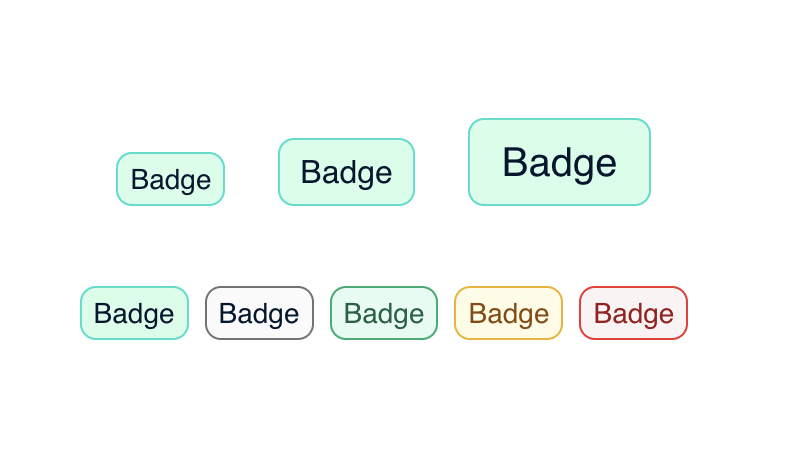

## Overview

A selection of UI components I've created.

## Components 

### Table of contents

- [Badge](#badge)
- [Blog card](#blog-card)

#### Badge

[Code repro]('https://github.com/afoon/ui-design/blob/develop/src/components/Badge/Badge.tsx')

#### Blog Card

[Code Repro]('https://github.com/afoon/blog-card')
